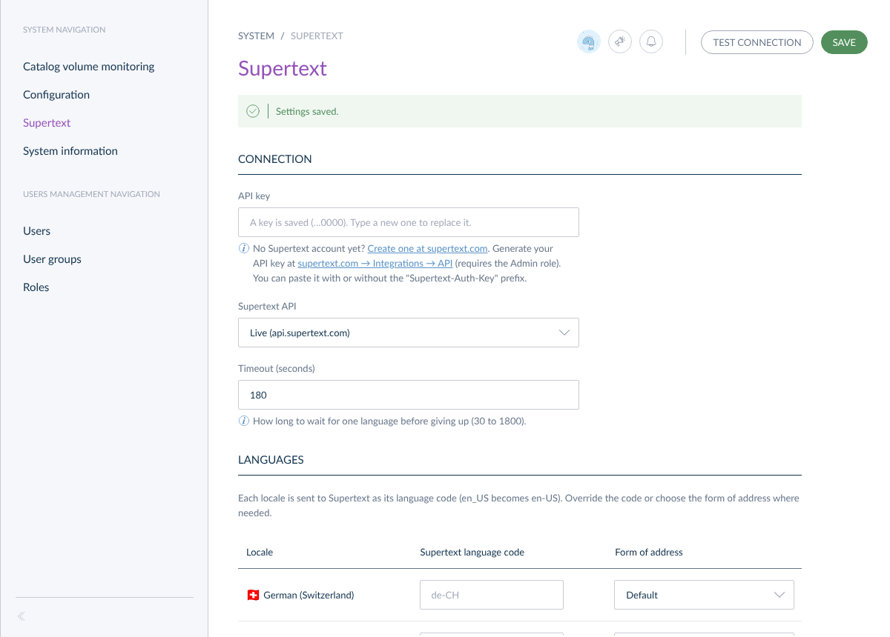
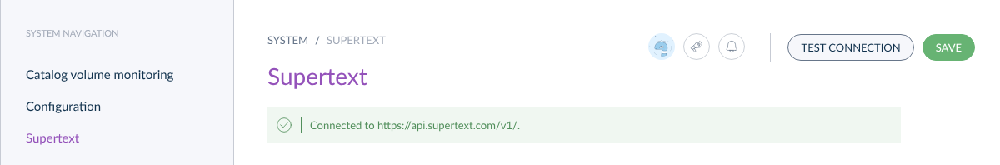
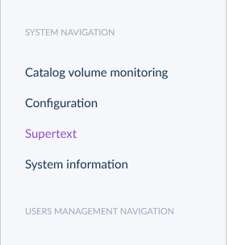
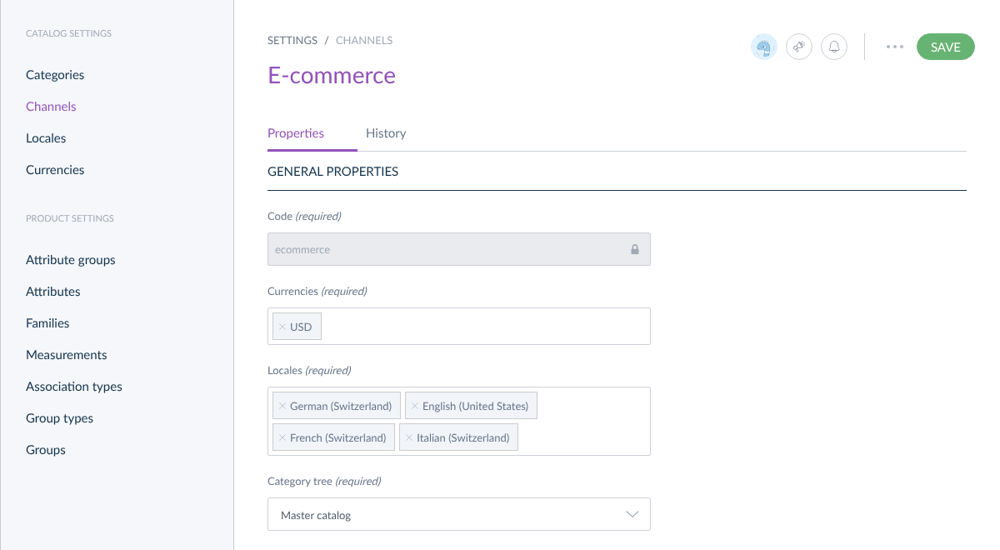

# Installation guide — Supertext Translation for Akeneo PIM

For administrators: install the bundle, enter the Supertext API key, set up the locales and choose who may translate.

## Requirements

- Akeneo PIM **Community Edition 2026.4** (tested; 2026.3 should work too), installed from the Community Standard Edition (`akeneo/pim-community-standard`), with its PHP 8.3, MySQL 8.4 and Elasticsearch 8 requirements.
- Node.js 18 and Yarn, which Akeneo needs anyway to build its front end: the bundle adds screens, so the front end is rebuilt once after installing.
- A Supertext account and an API key. No Supertext account yet? Create one at [supertext.com](https://www.supertext.com/person/en/account/signin). Generate your API key at [supertext.com → Integrations → API](https://www.supertext.com/en/integrations/api) (requires the Admin role).
- Outgoing HTTPS from the Akeneo server to `api.supertext.com`.

The bundle is for the self-hosted Community Edition. Akeneo's SaaS editions (Serenity, Growth) don't run third-party bundles.

## Install

1. Add the package to your Akeneo project (it is not on Packagist yet, so add the repository first):

   ```bash
   composer config repositories.supertext vcs https://github.com/Supertext/Akeneo-Supertext-Translation
   composer require supertext/akeneo-supertext-translation:dev-main
   ```

2. Register the bundle in `config/bundles.php`:

   ```php
   return [
       Supertext\AkeneoTranslationBundle\SupertextTranslationBundle::class => ['all' => true],
   ];
   ```

3. Add its routes in `config/routes/supertext_translation.yml`:

   ```yaml
   supertext_translation:
       resource: '@SupertextTranslationBundle/Resources/config/routing.yml'
   ```

4. Rebuild the cache and the front end (the same steps as Akeneo's `make upgrade-front`):

   ```bash
   rm -rf var/cache && bin/console cache:warmup
   bin/console pim:installer:assets --clean
   yarn run less
   yarn run webpack
   yarn run update-extensions
   ```

   Without this step the *Translate with Supertext* entry and the System → Supertext page don't appear.

The bundle needs no database migration: it keeps its settings as one row in Akeneo's `pim_configuration` table.

### Update

```bash
composer update supertext/akeneo-supertext-translation
```

Then repeat step 4. See [CHANGELOG.md](../CHANGELOG.md) for what changed.

### Uninstall

1. Remove the line from `config/bundles.php` and delete `config/routes/supertext_translation.yml`.
2. `composer remove supertext/akeneo-supertext-translation`, then repeat step 4.
3. Optional: delete the saved settings with `DELETE FROM pim_configuration WHERE code = 'supertext_translation';`.

Translations that were already made stay in your products: they are ordinary product values.

## API key

Open **System → Supertext**, paste the key into **API key** and click **Save**. **Test connection** checks the key with Supertext (free of charge). You can paste the key with or without the `Supertext-Auth-Key` prefix Supertext shows it with.



The page shows the account and key links: no Supertext account yet? Create one at supertext.com (<https://www.supertext.com/person/en/account/signin>). Generate your API key at supertext.com → Integrations → API (<https://www.supertext.com/en/integrations/api>; requires the Admin role).



Instead of the settings page you can set the key on the server as the environment variable `SUPERTEXT_API_KEY` (for example in `.env.local` or your hosting platform). The variable takes precedence; the page then says the key is set by the environment. The key is never shown again after saving and never sent to the browser.

The entry **Supertext** sits in the **System** menu, next to *Configuration*:



## Languages

Akeneo translates between **locales**, and a locale is active when a channel uses it. To translate into a language, add its locale to a channel under **Settings → Channels**:



- Values of attributes that are *localizable* get one value per locale. Values that are also *scopable* (per channel) are translated into the locales of their channel only.
- Each locale goes to Supertext as its language code: `de_CH` becomes `de-CH`, `en_US` becomes `en-US`. Override the code under **System → Supertext → Languages** if you need another one (for example `de-CH` for an `de_DE` locale whose texts follow Swiss spelling).
- **Form of address** per locale: *Default*, *Formal* or *Informal* (for languages that distinguish them, such as German *Sie* and *du*).

## Which values are translated

Localizable **text** and **text area** attributes, rich text included (headings, bold text, links and lists are kept). Everything else (identifiers, options, numbers, assets, …) stays as it is. The [user guide](USER_GUIDE.md#what-is-translated) has the details.

## Permissions

| Action | Akeneo permission (System → Roles → Permissions) |
| --- | --- |
| Translate a product | *Products → Edit attributes of a product* |
| Translate a product model | *Product models → Edit attributes of a product model* |
| System → Supertext (API key and languages) | *System configuration* (the same permission as System → Configuration) |

There is no separate permission for translating: whoever may edit a product's attributes may translate it. In a new Akeneo installation every role has all permissions; remove *System configuration* from the roles that shouldn't see the API settings.

## Settings

| Setting | Where | Default | |
| --- | --- | --- | --- |
| API key | System → Supertext, or `SUPERTEXT_API_KEY` | none | The variable takes precedence. Stored in `pim_configuration` (code `supertext_translation`). |
| Supertext API | System → Supertext | Live | *Live* (`https://api.supertext.com/v1/`), *Staging*, *Testing* or *Custom address*. `SUPERTEXT_API_URL` overrides it (for tests against a stand-in). |
| API address | System → Supertext | none | Only for *Custom address*. |
| Timeout (seconds) | System → Supertext | 180 | How long to wait for one language (30 to 1800). |
| Supertext language code | System → Supertext → Languages | the locale with a hyphen | Per locale, e.g. `de-CH`. |
| Form of address | System → Supertext → Languages | Default | Per locale: Default, Formal, Informal. |

The bottom of System → Supertext shows the installed version of the bundle (as Composer reports it) with a link to its GitHub release; `bin/console supertext:check` prints it too.

## Console commands

```bash
bin/console supertext:check                                      # is the key set and accepted?
bin/console supertext:translate praline-box-16 --from=en_US      # into all other locales
bin/console supertext:translate sku-1 sku-2 --from=en_US --to=de_CH,fr_CH --overwrite
bin/console supertext:translate dark-chocolate-bar --model --from=en_US   # product models by code
```

Products are given by identifier or UUID. Without `--overwrite`, values that already have text are kept.

## Troubleshooting

| Problem | What to do |
| --- | --- |
| No *Translate with Supertext* entry in the product's "…" menu, or no System → Supertext | The front end wasn't rebuilt after installing: repeat step 4 of *Install*, then reload the browser. Check that the user has the permissions above. |
| "No Supertext API key is configured." | Enter the key under System → Supertext or set `SUPERTEXT_API_KEY`. No Supertext account yet? Create one at supertext.com. Generate your API key at supertext.com → Integrations → API (requires the Admin role). |
| "Authentication failed. Please check the Supertext API key." | The key is wrong or was revoked: generate a new one at <https://www.supertext.com/en/integrations/api> and save it. |
| "Too many requests to Supertext." | The API limits requests per second per key. The bundle already retries; wait a moment and try again. |
| "Timed out waiting for the Supertext translation." | Raise *Timeout* under System → Supertext, or translate fewer languages at once. |
| "Akeneo did not accept the translation: …" | Akeneo's own validation rejected a translated value (for example a text attribute's maximum length). That language is left unchanged; the others are saved. |
| "Your Supertext translation limit is exceeded." | Upgrade your Supertext subscription. |
| A language is greyed out in the dialog | None of the product's text values belongs to a channel with that locale. Add the locale to the channel (Settings → Channels). |
| Errors in detail | `var/logs/prod.log` (search for "Supertext"). |
