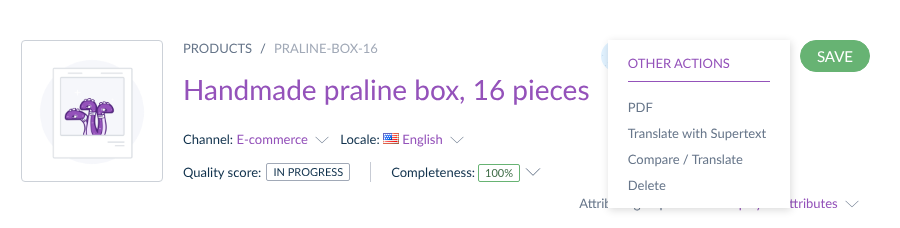
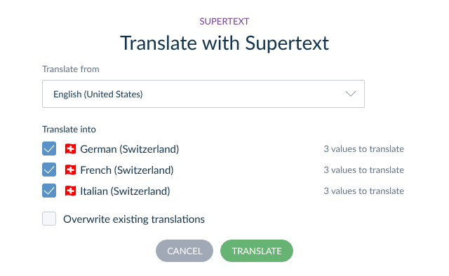
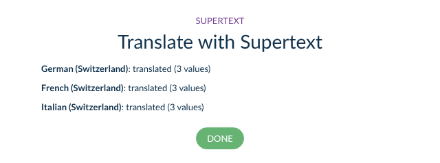
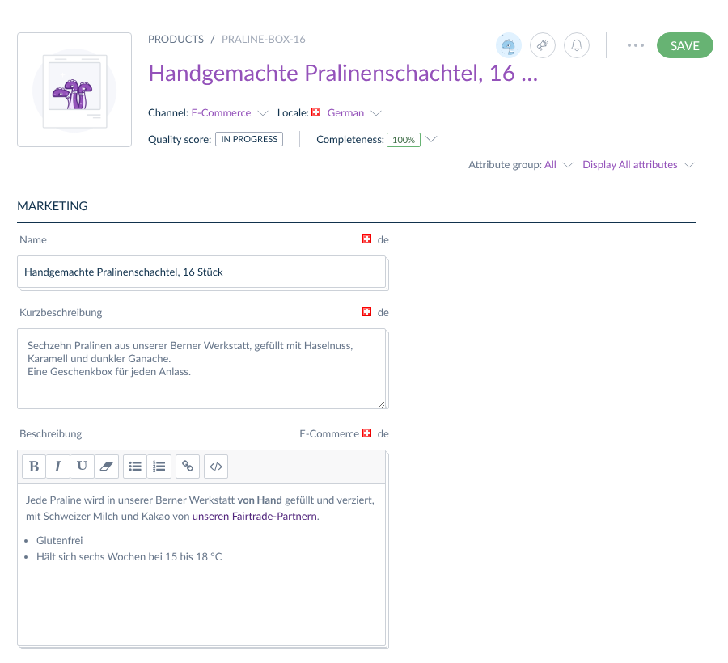
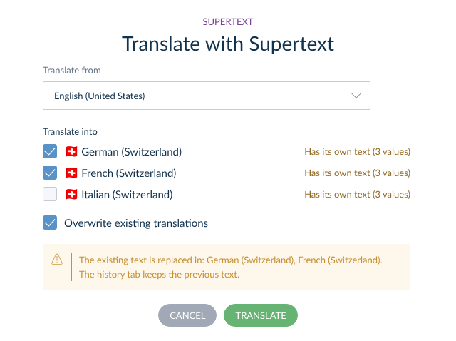

# User guide — Supertext Translation for Akeneo PIM

For editors: translate products and product models into your other locales with Supertext AI, then review the result in Akeneo as usual.

## Translate a product

1. Open the product (Products → click the product) and save any changes first.
2. Click the **…** button next to *Save* and choose **Translate with Supertext**.

   

3. Choose the language to translate **from** (your current catalog locale is preselected) and tick the languages to translate **into**. Languages without their own text yet are ticked already; next to each language you see how many values will be translated.

   

4. Click **Translate**. Supertext translates all text values of the product in one go per language; this usually takes a few seconds per language. The dialog then shows the result for each language:

   

5. Click **Done**. The product reloads with the new values.

If the form has unsaved changes when you open the dialog, Akeneo asks first: the form is reloaded after translating, so unsaved changes would be lost.

## Review the translation

Switch the **Locale** in the product header to see the translated values, and edit them like any other value:

The translation is saved as a normal change of the product: the **History** tab shows it with your name, and completeness and the search index are updated as for any edit.

## Translate again or update a translation

Languages that already have their own text are **kept**: the dialog shows *Has its own text* and leaves them unticked, and translating them again changes nothing. To replace them, for example after the English text changed, tick **Overwrite existing translations** and the languages. The dialog warns which languages will be overwritten:

Only the values that the source language has text for are written. A value that is empty in the source language is left alone in the other languages.

## Product models and variants

Product models have the same **Translate with Supertext** entry. Translate the product model to translate the texts its variants share (in Akeneo, a variant shows these values from its model). On a variant product, the dialog translates the values that belong to the variant itself; if all its texts come from the product model, it says so.

## What is translated

| Translated | Not translated |
| --- | --- |
| Localizable *Text* attributes (for example the name) | Attributes that aren't localizable (the same value for all locales) |
| Localizable *Text area* attributes, plain or rich text: headings, bold and italic text, links and lists are kept, and whole sentences are translated | Identifiers, options (simple and multi select), numbers, dates, measurements, prices, files, images, assets, tables and reference data |
| Values per channel (scopable attributes): each channel's text, into the locales of that channel | Attribute labels, option labels, family and category names (translate them under Settings) |
| | Values of a variant that come from its product model (translate the product model) |

Texts go to Supertext as one HTML document per language, and the translated values are checked by Akeneo before they are saved (for example the maximum length of a text attribute).

## Messages

| Message | What it means |
| --- | --- |
| No Supertext API key is configured. | An administrator has to enter the key under System → Supertext first. No Supertext account yet? Create one at supertext.com. The API key is generated at supertext.com → Integrations → API (requires the Admin role). |
| Authentication failed. Please check the Supertext API key. | The saved key is wrong or was revoked. Ask an administrator. |
| There is no text to translate in … | The product has no text values in the language you translate from. Choose another language. |
| Not used by the channels of these values | The product's texts belong to channels that don't have this locale. Ask an administrator to add the locale to the channel. |
| kept, it already has its own text | Nothing was changed in that language. Tick *Overwrite existing translations* to replace it. |
| Akeneo did not accept the translation: … | A translated value broke one of Akeneo's rules (for example it is too long). That language was not changed; the others were saved. |
| Too many requests to Supertext. | Supertext limits requests per second. Wait a moment and try again. |
| Timed out waiting for the Supertext translation. | Translate fewer languages at once, or ask an administrator to raise the timeout. |
| Your Supertext translation limit is exceeded. | The Supertext subscription needs an upgrade. |
| You are not allowed to edit this product. | You need the permission to edit the product's attributes. |
